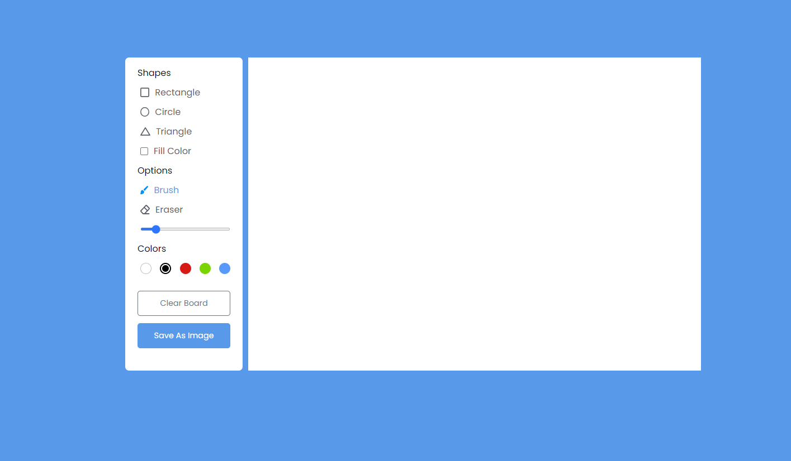

# Pixel Paint

Pixel Paint is a web-based painting application designed for creating pixel art. Built using HTML, CSS, and JavaScript, it features a user-friendly interface that allows users to draw, customize colors, and adjust brush sizes. The application also includes a convenient download feature for saving drawings locally.

## Features

- **Drawing Interface**: A user-friendly drawing area with customizable colors and brush sizes.
- **Download Drawings**: Save your creations locally with a single click.
- **Performance Optimization**: Smooth and responsive drawing experience.

## Live Demo

You can try out Pixel Paint [here](https://pixel-paint.alavyapandey.com/).



## Installation

To clone this repository and run Pixel Paint locally, follow these steps:

1. **Clone the Repository**

   Open your terminal and run the following command to clone the repository:

   ```bash```
   git clone https://github.com/alavyap/Pixel-Paint.git


   Navigate to the Project Directory


cd pixel-paint
Open the Application

Open the index.html file in your web browser. You can do this by either double-clicking the file or using a command like:


start index.html
(The above command works on Windows; use open index.html on macOS or xdg-open index.html on Linux.)

##Usage
Drawing: Use the color palette and brush size options to start creating your pixel art.
Saving: Click the "Download" button to save your drawing as a PNG file to your local system.

## Contributing
Feel free to submit issues or pull requests if you have suggestions or improvements for Pixel Paint.

## License
This project is licensed under the MIT License. See the LICENSE file for details.

## Contact
For any questions or feedback, please reach out to aalvya.pandey@gamil.com or Visit : https://www.alavyapandey.com/
